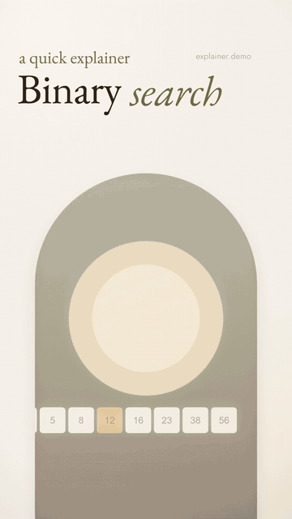
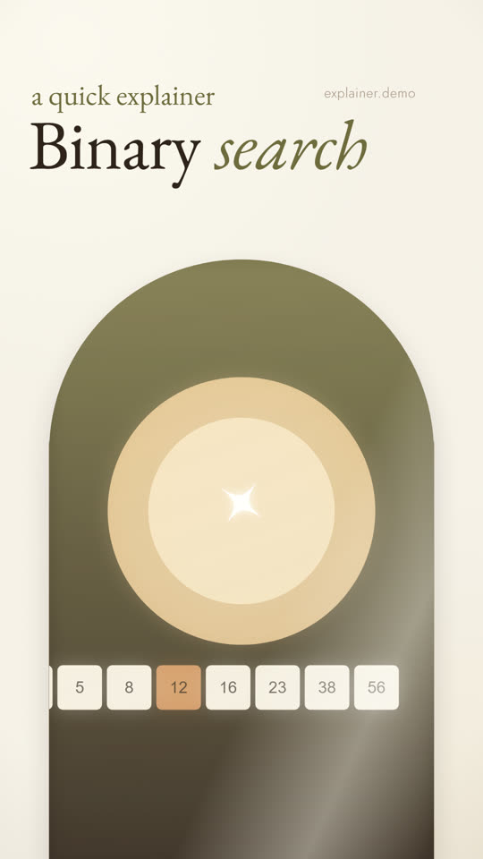
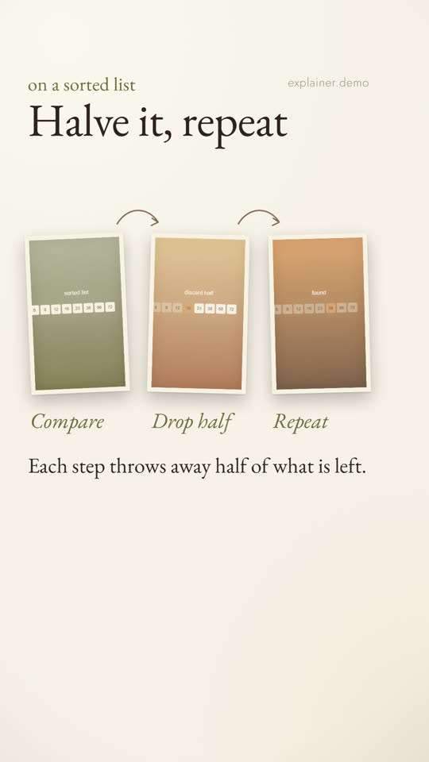
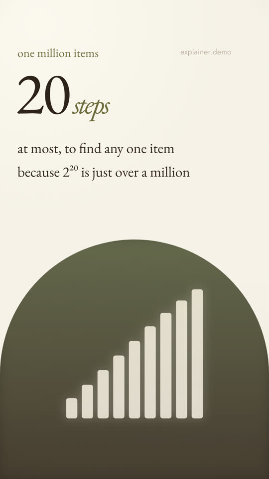

# Remotion Video Pipeline

This project renders short vertical explainer videos from code, so I don't have to edit each one by hand. A video is one config file with a list of scenes. Each scene picks a template and fills in its text and images, and Remotion renders it at 1080x1920.

There are also a few scripts that render preview stills, check the layout and review the motion, so I can catch problems without watching every render.



| Cover | Steps | Stat |
|---|---|---|
|  |  |  |

These come from the included demo, "How a binary search works" (about 24 seconds). Its art is SVG made for this repo.

## How it's built

React, TypeScript, Remotion and Zod.

- `src/topics/<slug>.ts`: one video, as a list of scenes with their text and images.
- `src/scenes/`: eight scene templates (cover, steps, stat, bars, timeline, spread, next, takeaway).
- `src/video/schema.ts`: Zod schemas, so a bad config fails with a readable error instead of a broken render.
- `scripts/`: preview, render, layout check and motion review.

The script I'd look at first is `scripts/check.mjs`. It checks the text against the safe area, how long each page holds still, and the reading time.

To add a video, write a config in `src/topics/` and add it to `src/topics/index.ts`.

## Run

Needs Node.js (I used v24) and `ffmpeg` on the PATH.

```console
npm install
npm run dev                            # Remotion Studio, pick "binary-search"
npm run preview -- binary-search       # sample stills and a contact sheet
npm run check -- binary-search         # layout check: safe area, hold times, reading time
npm run render -- binary-search        # final MP4 in out/renders/
npm run motion-qa -- binary-search     # reads the MP4 with ffmpeg: cuts, flicker, drift
```

## Limitations

- Checking is done by `npm run lint`, which type-checks the source, and `npm run check`, the automated layout check, rather than by unit tests.
- The thresholds in `check` (reading speed, hold times) are tuned by watching renders, not taken from a standard.
- The demo has no audio. The GIF above is a downscaled copy of the rendered demo, and the MP4 itself isn't in the repo.
